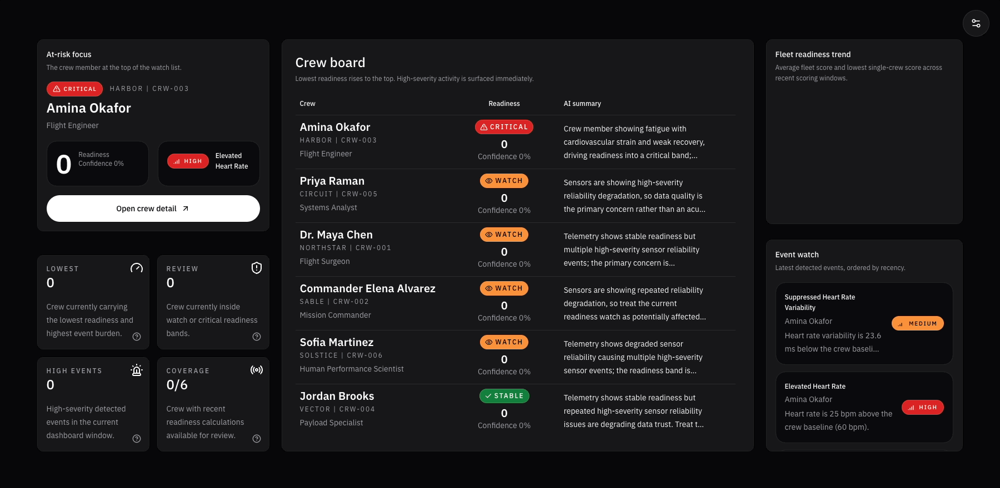

# HHPC2 - Crew Readiness Platform

> A hosted demo of a rapid prototype demonstrating how complex, data-driven systems can be rapidly designed, implemented, and validated using modern full-stack and AI-assisted development practices.

## Overview

The Crew Readiness Platform is a rapid prototype decision-support system designed to transform noisy physiological and activity-based sensor data into structured, explainable insights for operational use.

It simulates the type of internal tooling used in mission-critical environments, where real-world data is imperfect, time-sensitive, and directly tied to human performance and safety.

This project demonstrates how modern full-stack architecture, data pipeline design, and AI-assisted development workflows can be used to rapidly build systems that are both technically robust and aligned with real operational needs.

---

## What This System Does

At a high level, the platform:

- Ingests time-series physiological and activity data (simulated)
- Handles real-world data conditions such as missing values, noise, and sensor failure
- Normalizes and processes signals into consistent, comparable formats
- Detects anomalies and trends relative to individual baselines
- Computes a transparent readiness score for each subject
- Surfaces insights through a dashboard designed for rapid interpretation
- Provides AI-assisted summaries that support, but do not replace, human judgment

The system supports both:

- Multi-subject monitoring for high-level awareness
- Individual deep-dive analysis for detailed investigation

---

## Why This Project Exists

In environments where decisions depend on real-world sensor data, the challenge is not just collecting information, but making it usable.

Raw signals are often:

- incomplete or inconsistent
- difficult to interpret in isolation
- prone to sensor-related errors
- highly dependent on individual baselines

This project explores how to design systems that:

- turn imperfect data into actionable insight
- preserve traceability from input to output
- balance automation with human oversight
- support rapid iteration without sacrificing structure

It is intentionally scoped as a realistic internal tool rather than a polished consumer application, and this repository is shipped as a hosted demo of that rapid prototype.

---

## Important Context

This project is a conceptual prototype inspired by NASA’s (HHP) initiative and the (HHPC2) contract. 

Within this repository, “HHPC2” is used as a framing device to imagine what a system _could_ look like if developed under that contract.

### Scope and Data Disclaimer

This project does **not** use real NASA data, validated datasets, or official standards. All data shown is simulated for demonstration purposes.

A production-grade system would require:

- Collaboration with domain experts (engineers, data scientists, medical professionals)
- Alignment with existing NASA data standards and telemetry systems
- Rigorous validation of data accuracy, models, and outputs

That level of rigor would typically be defined during early planning and architecture phases, similar to what is outlined in the `planning-docs` directory of this repository.

### UI and Experience Disclaimer

The interfaces and visualizations in this project are not intended to represent actual NASA tools or requirements.

They are a thought exercise focused on:

- Exploring how sensor-driven health data might be surfaced
- Demonstrating how AI could assist in interpreting that data
- Showcasing rapid prototyping of complex, data-driven systems

This is a conceptual exploration, not a specification or recommendation for real-world HHP systems.

---

## Approach

This platform is built around a few core principles:

### End-to-End Thinking

The system is designed as a complete pipeline:

- simulation → ingestion → normalization → analysis → visualization → review

Each stage is explicit and traceable.

### Realistic Data Conditions

Instead of relying on clean datasets, the system simulates:

- sensor dropouts
- irregular sampling
- noisy signals
- conflicting inputs

This allows the system to be evaluated under conditions closer to real-world operation.

### Explainability Over Complexity

All derived outputs, including readiness scores and summaries, are designed to be:

- understandable
- traceable
- reviewable

AI is used as an assistive layer, not a decision-maker.

### Rapid, Structured Prototyping

The system is built to demonstrate how complex ideas can be:

- implemented quickly
- structured for maintainability
- aligned with business and operational goals from the start

---

## Technical Highlights

- Full-stack TypeScript application using Next.js
- Dashboard UI built with ShadCN and Tailwind CSS
- Supabase-backed data layer with clear separation of raw and processed data
- Simulation engine for generating realistic physiological signals
- Modular processing pipeline for normalization, event detection, and scoring
- AI-assisted summarization with human-in-the-loop validation
- Tooling-first development approach, including AI-assisted coding workflows

---

## Documentation

This repository includes implementation, active project documentation, and the original planning set used to define the system before build-out.

### Planning

Original requirements, planning, and roadmap artifacts.

- `planning-docs/business-requirements.md` – objectives, scope, and success criteria
- `planning-docs/executive-summary.md` – high-level system overview
- `planning-docs/functional-requirements.md` – system behavior and feature definitions
- `planning-docs/implementation-roadmap.md` – phased delivery plan
- `planning-docs/raci-matrix.md` – roles and ownership model
- `planning-docs/technical-requirements.md` – architecture, stack, and constraints

### Project

Living project documentation and walkthroughs.

- `docs/demo-scenario-walkthroughs.md` - scripted demo scenarios and operator walkthroughs
- `docs/engineering-standards.md` - current engineering patterns, naming, and implementation boundaries

Together, these documents describe not just what the system does, but how and why it was designed.

---

## Intended Audience

This project is intended for:

- engineers interested in system design and data pipelines
- technical leaders evaluating rapid prototyping approaches
- stakeholders exploring how complex ideas can be translated into working systems
- teams interested in practical applications of AI-assisted development

---

## Notes

- This is a prototype system designed for demonstration purposes
- Data is simulated and not clinically validated
- The focus is on system design, architecture, and workflow—not medical accuracy

---

## Summary

The Crew Readiness Platform demonstrates how a modern engineering approach can bring together:

- structured system design
- real-world data handling
- AI-assisted workflows
- and rapid delivery

to produce meaningful, operationally relevant software in a short timeframe.

---

## Developer Documentation

Developer-specific documentation lives outside this file:

- `AGENTS.md` for project rules and AI execution boundaries
- `CONTRIBUTING.md` for branch, commit, PR, and validation expectations
- `DEVELOPERS.md` for local setup, commands, Supabase workflow, and AI workspace setup
- `docs/` for living project documentation and walkthroughs
- `planning-docs/` for original requirements, planning, and roadmap artifacts
